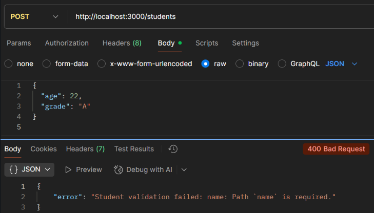
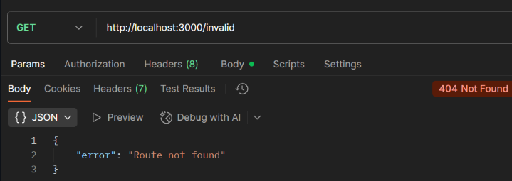

# Experiment 9: Implement Status Codes and Error Handling for Invalid Requests

*Course Outcomes (CO3, CO6):*  
- Learn to use proper HTTP status codes in a REST API.  
- Implement centralized error handling middleware in Express.  
- Handle invalid requests gracefully.  

---
## Screenshots

Here’s a preview of the app:





## Objective

- Improve the REST API from Experiment 8 by adding:
  - Proper HTTP status codes.  
  - Centralized error handling.  
  - Custom error responses for invalid requests.  

---

## Project Setup

```bash
mkdir express-error-handling
cd express-error-handling
npm init -y
npm install express mongoose body-parser
